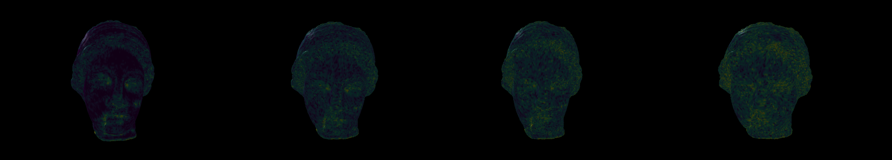

# Mesh Local Roughness

A python program to compute and display the local roughness of a 3D mesh.

---

venus mesh with increasing roughness



## Test the program

install required packages

```
pip install -r requirements.txt 
```

run script

```
python meshroughness.py
```

you can also download [LIRIS/EPFL 3D Model General-Purpose database](https://perso.liris.cnrs.fr/guillaume.lavoue/data/datasets.html) to test the program(need to convert to .off meshes)

## Reference

[A local roughness measure for 3D meshes and its application to visual masking](https://www.semanticscholar.org/paper/A-local-roughness-measure-for-3D-meshes-and-its-to-Lavou%C3%A9/670924b050e53d7d6f5369018271eb086cd39dfd)

[A fast roughness-based approach to the assessment of 3D mesh visual quality]()
